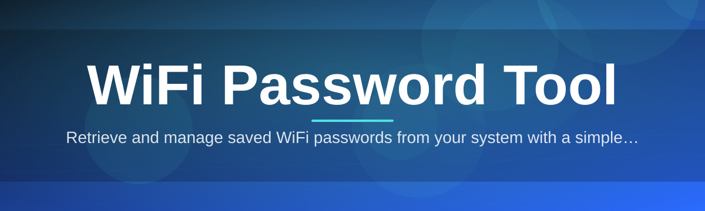

# wifi-password-config-editor 📶🔐

  

*See the network profiles Windows already trusts, and manage them without digging through five menus.*

  

---

## 🧭 Overview

Windows stores every WiFi password you've ever told it to remember. That information sits inside network profile configuration, hidden behind Control Panel dialogs and Netsh commands most people never learn. **wifi-password-config-editor** is a desktop utility built for 2026-era Windows systems that surfaces those saved profiles in one clean window — readable, searchable, exportable.

This project exists because password recovery shouldn't require a terminal. IT technicians re-provisioning laptops, home users switching routers, and small offices auditing which devices know which credentials all run into the same wall: the information is technically *available*, but practically buried. We built a config editor that treats WiFi profile management as a first-class task instead of an afterthought hidden three clicks deep in Settings.

| | |
|---|---|
| **Who it's for** | Sysadmins, IT support desks, home power users, small-office network managers |
| **What it isn't** | A network scanner, a router administration tool, or a way to view networks you don't already have access to |
| **Core promise** | Read what Windows already stored. Present it clearly. Let you act on it. |

> [!NOTE]
> This tool only reads WiFi profiles already saved on the local Windows machine you're running it on. It does not scan, intercept, or access networks the device hasn't already connected to.

### Before / After

| | Before | After |
|---|---|---|
| **Finding a saved password** | Open Settings → Network → adapter properties → Wireless Properties → Security tab → checkbox → re-authenticate | One search box, one click |
| **Exporting profiles** | Manual `netsh` commands typed per-network | Bulk export from a single list view |
| **Auditing devices** | No native view of all saved SSIDs at once | Full table sorted by name, signal type, last connection |
| **Editing a profile** | Delete and re-add the network manually | Inline edit, save, done |
| **Learning curve** | Command-line syntax you'll forget by next week | A window that explains itself |

---

## 🚀 Get Started

---

## 🗂️ What's Under the Hood

Capabilities, laid out plainly, not as a marketing bullet parade.

| Capability | What it actually does |
|---|---|
| **Profile Discovery** | Enumerates every WiFi profile Windows has stored locally and lists it in a sortable table |
| **Password Reveal** | Decodes the stored key material for a selected profile into plain, readable text on demand |
| **Bulk Export** | Writes selected profiles to a portable file format for backup or migration to a new machine |
| **Inline Editing** | Lets you rename, re-key, or adjust security settings for a profile without deleting and re-adding it |
| **Search & Filter** | Narrows a long list of saved networks by SSID, security type, or connection recency instantly |
| **Signal Metadata** | Shows authentication type, cipher, and connection mode alongside each stored network |
| **Config Backup Snapshot** | Saves the current full profile set as a single restore point before you make changes |
| **Dark & Light Themes** | Matches your Windows theme automatically or lets you pin one manually |
| **Offline Operation** | Runs with zero network calls of its own — everything happens against the local system store |

> [!TIP]
> Run **Config Backup Snapshot** before any bulk edit session. Restoring one file beats rebuilding twelve network profiles by hand.

---

## 🏁 How to Get Started

1. Open the landing page using the download button above.

2. Download the latest standalone build for Windows 10 or 11.

3. Run the executable — no installer wizard, no background service left behind.

4. Grant the administrator prompt when asked. Reading stored network keys requires elevated access on Windows by design.

> [!IMPORTANT]
> The administrator prompt isn't optional theatrics. Windows guards saved WiFi key material specifically so that only elevated processes can decode it. This is a Windows security boundary, not a tool limitation.

---

## 💻 System Requirements

| Requirement | Detail |
|---|---|
| **OS** | Windows 10 (64-bit) or Windows 11 |
| **Dependencies** | None — fully standalone executable |
| **Disk space** | Under 15 MB |
| **RAM** | Negligible; runs comfortably alongside anything else open |
| **Admin rights** | Required for key decoding features |
| **Internet connection** | Not required after download |

  

---

## ⚙️ How It Works

The workflow is short on purpose. Fewer moving parts, fewer things to break.

1. **Launch** — the app starts and requests elevation.

2. **Query** — it asks the Windows WLAN service for the list of stored profile names.

3. **Decode** — for a selected profile, it requests the stored key material and renders it as text.

4. **Present** — results land in a searchable, sortable table.

5. **Act** — you export, edit, or back up from that same view.

<strong>Why does this need administrator rights at all?</strong>

 

Windows stores WiFi keys encrypted under the local system's DPAPI store. Only processes running with elevated privilege can request the WLAN API to return decoded key material. This is Microsoft's own security boundary — the tool works within it, not around it.

---

## 🩺 Troubleshooting

**Q: The app opens but shows no saved networks. Why?**
A: You likely declined the administrator prompt. Relaunch and accept elevation — profile enumeration without it returns an empty list by design.

**Q: A password field shows blank instead of the actual key.**
A: That profile may use an enterprise authentication method (802.1X) rather than a pre-shared key. There is no static password to reveal for those profiles.

**Q: Windows Defender flagged the download.**
A: Any tool that reads system-level network credentials triggers heuristic scanners. Verify the file hash against the one published on the landing page before running it.

**Q: I edited a profile and now that device won't reconnect.**
A: Restore your **Config Backup Snapshot** taken before the edit, or delete the profile and let Windows re-prompt for the password on next connection.

**Q: Exported file won't import on another machine.**
A: Confirm both machines are on matching Windows major versions. Profile schema formats shifted slightly between Windows 10 and 11 builds.

> [!WARNING]
> Only run this tool on hardware you own or are explicitly authorized to administer. Local profile access is a convenience feature for legitimate device owners, not a workaround for anything else.

---

## 🎛️ UI & UX Details

| Shortcut | Action |
|---|---|
| `Ctrl+F` | Focus the search box |
| `Ctrl+E` | Export selected profile(s) |
| `Ctrl+B` | Create a backup snapshot |
| `Delete` | Remove selected profile |
| `F5` | Refresh profile list |
| `Ctrl+D` | Toggle dark / light theme |

- Theme follows Windows system setting by default, override in **Settings → Appearance**.

- Column layout (SSID, security type, signal, last seen) is drag-to-reorder and persists between sessions.

- A quiet status bar at the bottom confirms every action — no intrusive modal popups for routine operations.

---

## 🤝 Contributing & Community

> [!NOTE]
> Contributions are reviewed with a bias toward stability over novelty. This tool touches sensitive system data — every pull request gets read carefully, not rubber-stamped.

- Open an issue for bugs, with your Windows build number attached.

- Propose features via discussion before submitting large pull requests.

- Small, focused commits are preferred over sweeping rewrites.

- Documentation fixes are as welcome as code — clarity is a feature here.

 

---

## 📄 License

Released under the [MIT License](LICENSE), 2026.

> [!TIP]
> MIT means you can fork, adapt, and redistribute — just keep the license notice attached.

---

## ⚖️ Disclaimer

This tool reads WiFi profile data already stored on the local Windows machine it runs on. It does not access, scan, or retrieve credentials for networks the device has not connected to. Use it only on systems you own or are authorized to manage. The maintainers assume no responsibility for misuse outside these boundaries.

---

